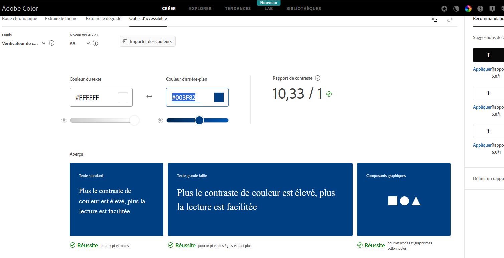

# Getting Started with Create React App

This project was bootstrapped with [Create React App](https://github.com/facebook/create-react-app).

## Available Scripts

In the project directory, you can run:

### `npm start`

Runs the app in the development mode.\
Open [http://localhost:3000](http://localhost:3000) to view it in your browser.

The page will reload when you make changes.\
You may also see any lint errors in the console.

### `npm test`

Launches the test runner in the interactive watch mode.\
See the section about [running tests](https://facebook.github.io/create-react-app/docs/running-tests) for more information.

### `npm run build`

Builds the app for production to the `build` folder.\
It correctly bundles React in production mode and optimizes the build for the best performance.

The build is minified and the filenames include the hashes.\
Your app is ready to be deployed!

See the section about [deployment](https://facebook.github.io/create-react-app/docs/deployment) for more information.

### `npm run eject`

**Note: this is a one-way operation. Once you `eject`, you can't go back!**

If you aren't satisfied with the build tool and configuration choices, you can `eject` at any time. This command will remove the single build dependency from your project.

Instead, it will copy all the configuration files and the transitive dependencies (webpack, Babel, ESLint, etc) right into your project so you have full control over them. All of the commands except `eject` will still work, but they will point to the copied scripts so you can tweak them. At this point you're on your own.

You don't have to ever use `eject`. The curated feature set is suitable for small and middle deployments, and you shouldn't feel obligated to use this feature. However we understand that this tool wouldn't be useful if you couldn't customize it when you are ready for it.

## Learn More

You can learn more in the [Create React App documentation](https://facebook.github.io/create-react-app/docs/getting-started).

To learn React, check out the [React documentation](https://reactjs.org/).

### Code Splitting

This section has moved here: [https://facebook.github.io/create-react-app/docs/code-splitting](https://facebook.github.io/create-react-app/docs/code-splitting)

### Analyzing the Bundle Size

This section has moved here: [https://facebook.github.io/create-react-app/docs/analyzing-the-bundle-size](https://facebook.github.io/create-react-app/docs/analyzing-the-bundle-size)

### Making a Progressive Web App

This section has moved here: [https://facebook.github.io/create-react-app/docs/making-a-progressive-web-app](https://facebook.github.io/create-react-app/docs/making-a-progressive-web-app)

### Advanced Configuration

This section has moved here: [https://facebook.github.io/create-react-app/docs/advanced-configuration](https://facebook.github.io/create-react-app/docs/advanced-configuration)

### Deployment

This section has moved here: [https://facebook.github.io/create-react-app/docs/deployment](https://facebook.github.io/create-react-app/docs/deployment)

### `npm run build` fails to minify

This section has moved here: [https://facebook.github.io/create-react-app/docs/troubleshooting#npm-run-build-fails-to-minify](https://facebook.github.io/create-react-app/docs/troubleshooting#npm-run-build-fails-to-minify)

## ETUDE RAPPORT UX ##

Après étude des vidéos et lecture des feedback des utilisateurs, plusieurs problèmes apparaissent :

- Mauvaise gestion du message d'erreur si le user n'est pas enregistré lors du Login,
- mauvaise persistance des données de formulaire,
- manque d'explications sur le  parcours utilisateur notamment ordre des actions (entrer les moyens de paiements avant de créer des transactions),
- pour la version mobile les items de la navbar débordent du champ visuel,
- Les imputs sont trop petits,
- les utilisateurs sont obligés de se logger à chaque fois car leur session n'est pas sauvegardée en localStorage. 

Après mise en place d'une CI d'ux avec lighthouse, plusieurs problèmes apparaissent également :
- Un mauvais contraste entre le background-color et le text des boutons de la page login,
- du javascript inutilisé doit être supprimé pour améliorer les performances,
- syntaxe javascript ancienne à modifier en jsx par exemple pour optimiser la compatibilité avec les navigateurs et la perfomrances,
- certaines ressources bloquent le rendu initial avec des async ou des defer par exemple,
- le cache n'est pas bien géré, à mettre en place pour les ressources statiques. 

## RAPPORT DES MODIFICATIONS APPORTEES ##

Modification du background-color des button de la page de Login / Register après étude du ratio du contraste 

Avant 

Après

